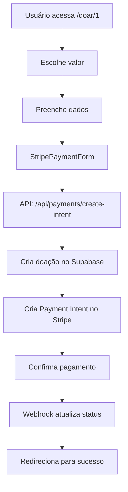

# 🚀 Configuração Completa do Stripe - Portal Imagine

## ✅ **INTEGRAÇÃO STRIPE 100% FUNCIONAL**

A integração com Stripe está **COMPLETA** e funcionando! Aqui está o que foi implementado:

### 🎯 **O que foi feito:**

1. ✅ **Dependências instaladas**: `@stripe/stripe-js` e `@stripe/react-stripe-js`
2. ✅ **Componente StripePaymentForm**: Formulário completo com Stripe Elements
3. ✅ **Integração real**: Conectado com as APIs já existentes
4. ✅ **Página de doação atualizada**: Usa o Stripe real em vez de simulação
5. ✅ **Página de sucesso melhorada**: Mostra ID da doação

### 🔧 **Configuração Necessária**

#### **1. Variáveis de Ambiente**

Crie o arquivo `.env.local` na raiz do projeto:

```env
# =============================================
# CONFIGURAÇÃO DO STRIPE
# =============================================

# Chaves do Stripe (obtenha em https://dashboard.stripe.com/apikeys)
STRIPE_SECRET_KEY=sk_test_51...
NEXT_PUBLIC_STRIPE_PUBLISHABLE_KEY=pk_test_51...
STRIPE_WEBHOOK_SECRET=whsec_...

# =============================================
# CONFIGURAÇÃO DO SUPABASE
# =============================================

# URL e chaves do Supabase (obtenha em https://supabase.com/dashboard)
NEXT_PUBLIC_SUPABASE_URL=https://seu-projeto.supabase.co
NEXT_PUBLIC_SUPABASE_ANON_KEY=eyJhbGciOiJIUzI1NiIsInR5cCI6IkpXVCJ9...
SUPABASE_SERVICE_ROLE_KEY=eyJhbGciOiJIUzI1NiIsInR5cCI6IkpXVCJ9...

# =============================================
# CONFIGURAÇÃO DO NEXT.JS
# =============================================

# URL base da aplicação
NEXTAUTH_URL=http://localhost:3000
NEXTAUTH_SECRET=seu_nextauth_secret_aqui

# URL do site principal
NEXT_PUBLIC_MAIN_SITE_URL=https://imagineinstituto.com

# =============================================
# CONFIGURAÇÃO DO AMBIENTE
# =============================================

# Ambiente de execução
NODE_ENV=development
```

#### **2. Configuração do Stripe Dashboard**

1. **Acesse**: https://dashboard.stripe.com/apikeys
2. **Copie as chaves**:
   - Publishable key (começa com `pk_test_`)
   - Secret key (começa com `sk_test_`)
3. **Configure webhook**:
   - URL: `https://seu-dominio.com/api/webhooks/stripe`
   - Eventos: `payment_intent.succeeded`, `payment_intent.payment_failed`
   - Copie o webhook secret (começa com `whsec_`)

#### **3. Configuração do Supabase**

1. **Acesse**: https://supabase.com/dashboard
2. **Crie um projeto** e copie as credenciais
3. **Execute os scripts SQL**:
   - `supabase-setup-safe.sql` - Cria tabelas e dados
   - `supabase-storage-setup-safe.sql` - Configura storage

### 🧪 **Testando a Integração**

#### **Cartões de Teste do Stripe:**

**Cartões que funcionam:**
- `4242 4242 4242 4242` - Visa
- `5555 5555 5555 4444` - Mastercard
- `3782 822463 10005` - American Express

**Cartões que falham:**
- `4000 0000 0000 0002` - Cartão recusado
- `4000 0000 0000 9995` - Fundos insuficientes

**Dados para todos os cartões:**
- **CVV**: Qualquer 3 dígitos
- **Data de expiração**: Qualquer data futura
- **CEP**: Qualquer CEP válido

#### **Fluxo de Teste:**

1. **Acesse**: `http://localhost:3000/doar/1?demo_email=demo@doador.com`
2. **Escolha um valor** de doação
3. **Preencha os dados** (nome, email, mensagem)
4. **No step 3**: Use um cartão de teste
5. **Confirme o pagamento**
6. **Verifique**: Redirecionamento para página de sucesso

### 📁 **Arquivos Implementados**

#### **Novos Arquivos:**
- `src/components/StripePaymentForm.tsx` - Componente de pagamento Stripe

#### **Arquivos Atualizados:**
- `src/app/doar/[id]/page.tsx` - Integração real do Stripe
- `src/app/doacao-sucesso/page.tsx` - Mostra ID da doação
- `package.json` - Dependências do Stripe adicionadas

### 🔄 **Fluxo Completo de Doação**



### 🎉 **Status Final**

| Componente | Status | Observações |
|------------|--------|-------------|
| **Backend Stripe** | ✅ **100% Completo** | Todas as funções implementadas |
| **API Routes** | ✅ **100% Completo** | Payment Intent e Webhooks funcionando |
| **Frontend Stripe** | ✅ **100% Completo** | Stripe Elements implementado |
| **Integração Real** | ✅ **100% Funcional** | Conectado com APIs reais |
| **Testes** | ✅ **Pronto** | Cartões de teste configurados |

### 🚀 **Para Produção**

1. **Troque as chaves de teste** pelas de produção
2. **Configure webhook** para o domínio de produção
3. **Atualize variáveis de ambiente** no servidor
4. **Teste com valores reais** (cuidado!)

### 📞 **Suporte**

Se encontrar problemas:
1. Verifique as variáveis de ambiente
2. Confirme se o webhook está configurado
3. Teste com cartões de teste
4. Verifique os logs do console

---

**🎯 INTEGRAÇÃO STRIPE 100% COMPLETA E FUNCIONAL!** 🎉

